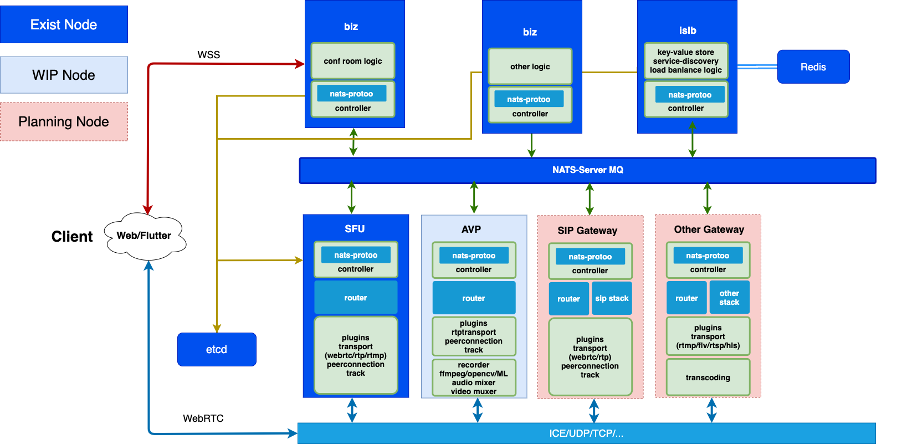

# ION
ION is a distributed RTC system written by pure go and flutter

## Architecture


## Features

- [x] Pure GO
	- [x] GO mod support
- [x] CentOS support
	- [x] Script support CentOS
- [x] SFU
	- [x] Signal protocol by protoo
	- [x] WebRTC stack by pion
	- [x] Nack support
	- [x] PLI support
	- [x] Anti-Loss-Package 30%~50%(local test by Eye/Network-Link-Conditioner)
- [x] Distributed System
	- [x] Ion-Ion rtp relay
	- [x] MQ support

- [x] SDK
	- [x] JS SDK
	- [x] Flutter SDK


## Contributing
* [adwpc](https://github.com/adwpc) - *Original Author - ion sfu server*
* [cloudwebrtc](https://github.com/cloudwebrtc) - *Original Author - ion sfu sdk*

## Roadmap


[Projects](https://github.com/pion/ion/projects/1)
Welcome contributing to ion!

## Project status
[](https://starchart.cc/pion/ion)

## How to use
### 1. make key
```
./scripts/makeKey.sh
```
### 2. build
```
//centos
./scripts/centos/installDeps.sh

//mac
./scripts/centos/installDeps.sh
```
### 3. run
```
//centos
./scripts/centos/allRestart.sh

//mac
./scripts/mac/allRestart.sh
```
### 4. let's chat
Open this url with chrome

```
https://yourip:8080
```


