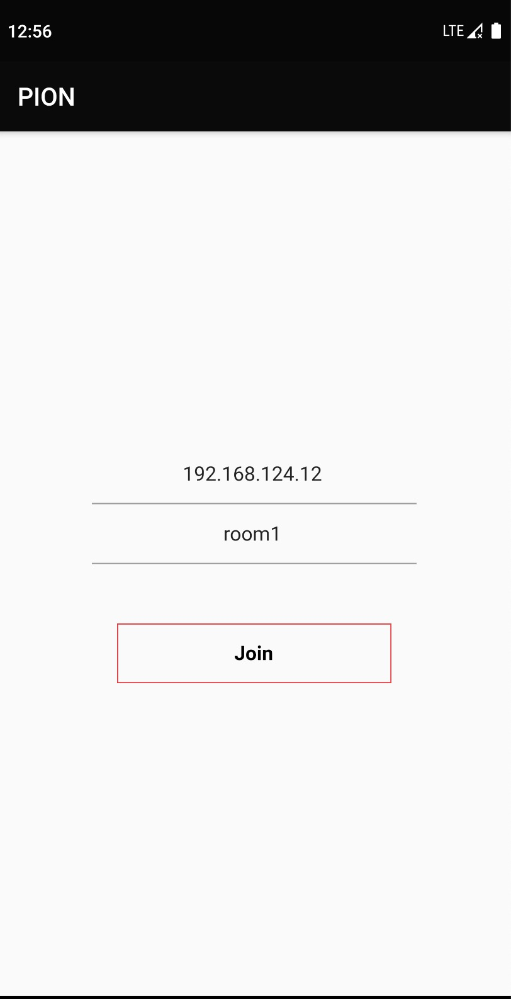
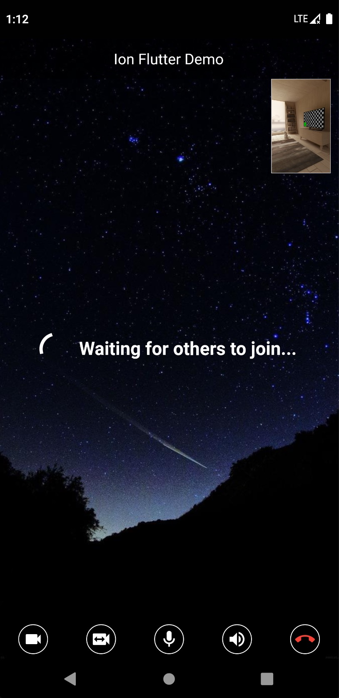
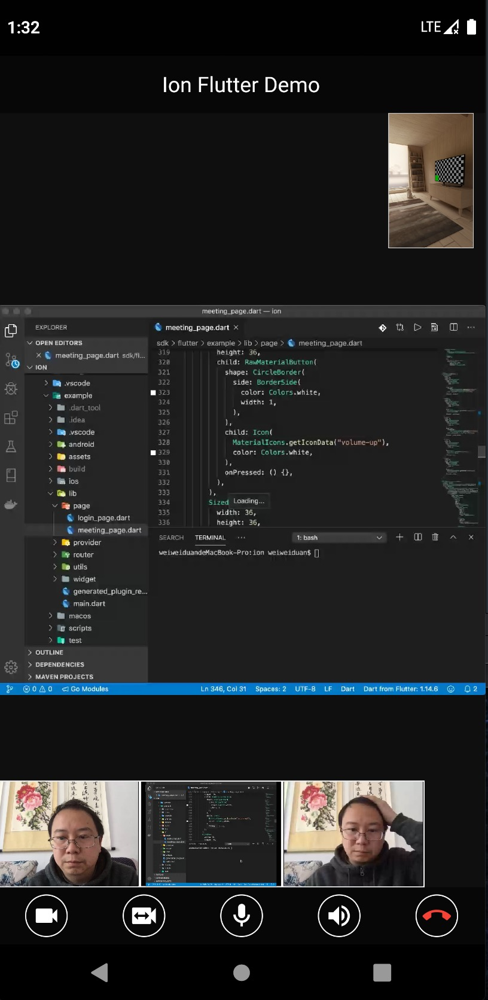
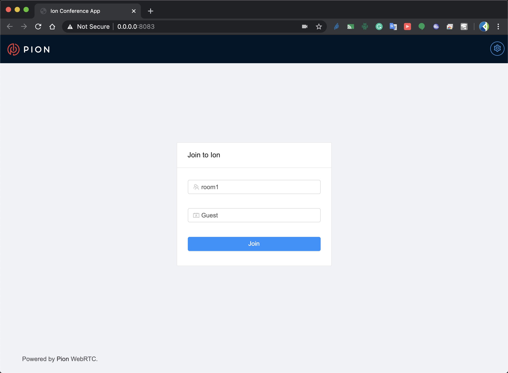
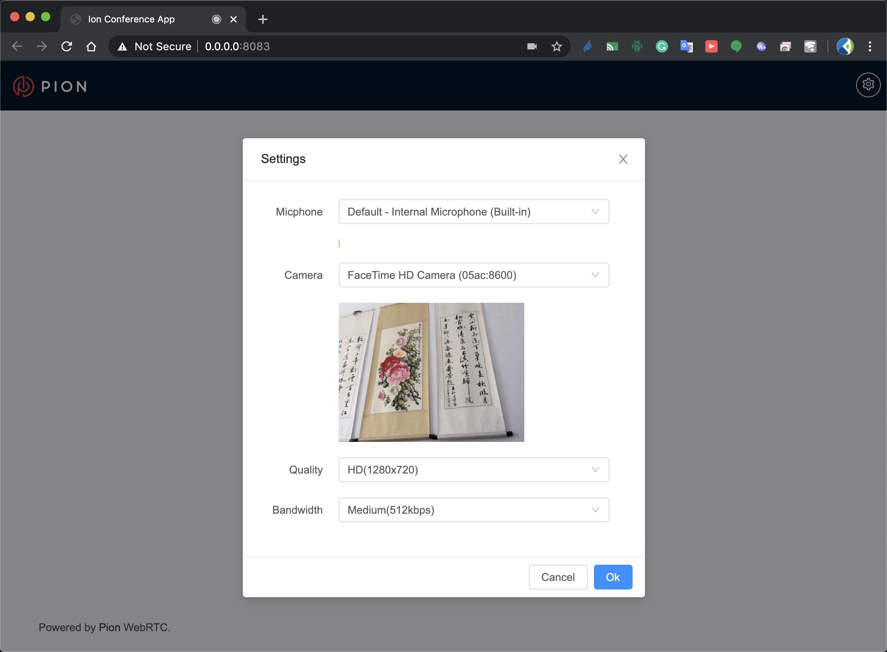
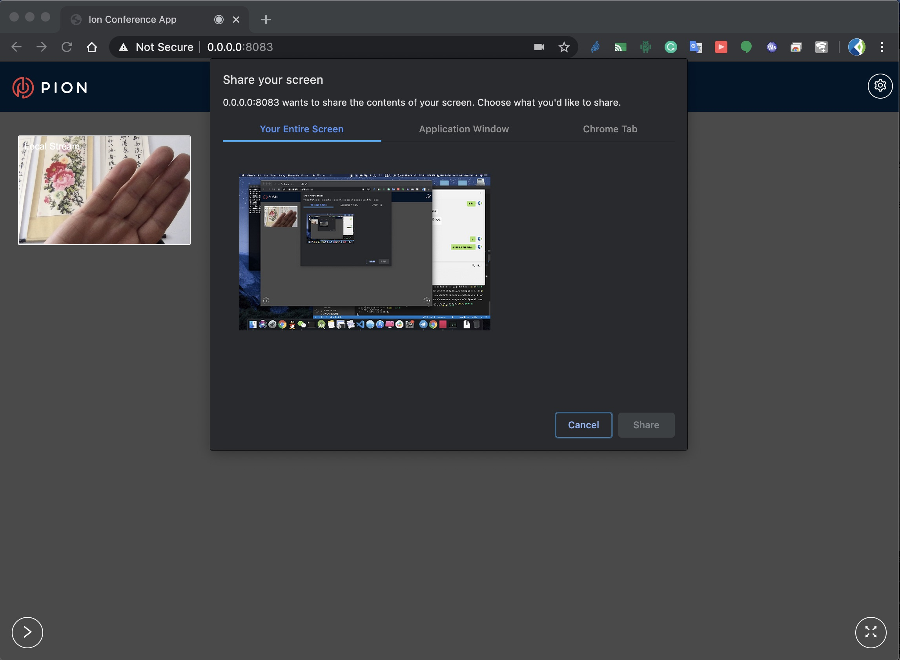
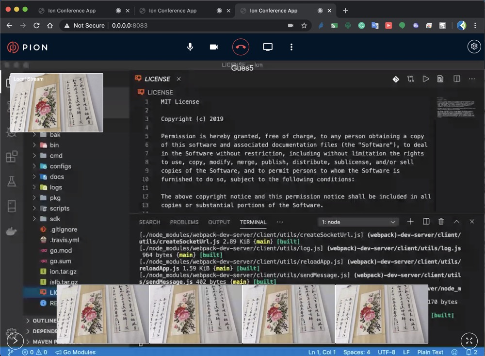

# ION

ION is a distributed RTC system written by pure go and flutter

[](https://opencollective.com/pion-ion) [](https://travis-ci.com/pion/ion)

[](https://pion.ly/slack)
[](https://goreportcard.com/report/github.com/pion/ion)

## 


## Wiki

https://github.com/pion/ion/wiki

## Architecture


## Contributing

- [adwpc](https://github.com/adwpc) - _Original Author - ion server_
- [cloudwebrtc](https://github.com/cloudwebrtc) - _Original Author - ion server and client sdk_
- [kangshaojun](https://github.com/kangshaojun) - _Contributor UI - flutter and react.js_
- [Sean-Der](https://github.com/Sean-Der) - _ion server and docker file_ 
- [sashaaro](https://github.com/sashaaro) - _docker file_
- [tarrencev](https://github.com/tarrencev) - _audio video process_

## Roadmap

[Projects](https://github.com/pion/ion/projects/1)
Welcome contributing to ion!

## Stars

[](https://starchart.cc/pion/ion)

# Screenshots

## iOS/Android

  

## PC/HTML5

 
 

## How to use

### Local Deployment
#### 1. clone
```
git clone https://github.com/pion/ion
```

#### 2. run
Firstly pull images. Skip this command if you want build images locally
```
docker-compose pull
```

```
docker-compose up
```

#### 3. chat
Open this url with chrome

```
http://localhost:8080
```

### Online Deployment

#### 1. clone

```
git clone https://github.com/pion/ion
```

#### 2. set env

```
export WWW_URL=yourdomain
export ADMIN_EMAIL=yourname@yourdomain
```

#### 3. run

```
docker-compose up
```

#### 3. chat

Open this url with chrome

```
https://yourdomain:8080
```

### Docker Tips

The provided docker-compose works for deploying to open usage, and can also be used for local development. It also supports auto-generate of certificates via LetsEncrypt.

It accepts the following enviroment variables.

* `WWW_URL` -- Public URL if auto-generating certificates
* `ADMIN_EMAIL`  -- Email if auto-generating certificates

To run on `conference.pion.ly` you would run `WWW_URL=conference.pion.ly ADMIN_EMAIL=admin@pion.ly docker-compose up`

If `WWW_URL` is set you will access via `https://yourip:8080` OR `http://yourip:8080` if not running with TLS enabled.
