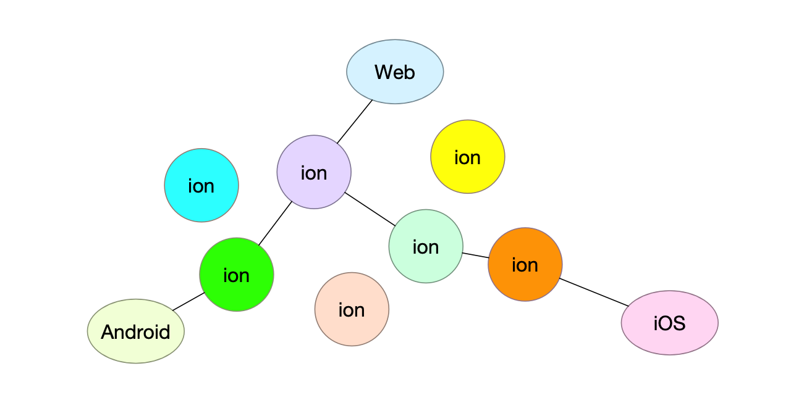

# SFU

## 1. Architecture

## 2. roadmap

* Media streaming support

  * Peer to browser by webrtc

  * Peer to peer by rtp

* Singal exchanging support

  * Singal protocol (room/stream/relay)

  * Exchange sdp/candidate/other

* Autoscaling router

  * Browser to peer

  * Peer to peer

* Admin system

  * Database operation

  * Node monitor/manager

  * Router manager
