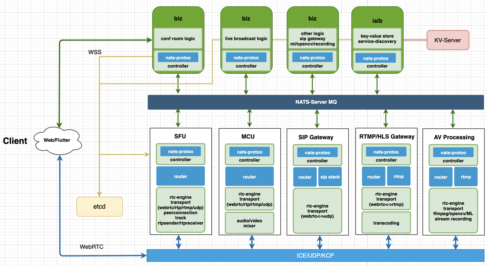

# ION

ION is a distributed RTC system written by pure go and flutter

[](https://opencollective.com/pion-ion) [](https://travis-ci.com/pion/ion)

[](https://pion.ly/slack)
[](https://goreportcard.com/report/github.com/pion/ion)

## Architecture



## Features

- [x] Distributed Node

  - [x] Standalone BIZ/ISLB and SFU node
  - [x] Message Queue by NATS
  - [x] SFU by Pure GO
  - [x] MCU (WIP)
  - [x] SFU<-->SFU relay (WIP)
  - [x] High Performance (WIP)

  - [x] Media Streaming
    - [x] WebRTC stack
    - [x] SIP stack (WIP)
    - [x] RTP/RTP over KCP
    - [x] JitterBuffer
      - [x] Nack
      - [x] PLI
      - [x] Lite-REMB
      - [x] Transport-CC(WIP)
      - [x] Anti-Loss-Package 30%+

- [x] SDK
  - [x] Flutter SDK
  - [x] JS SDK
- [x] Demo

## Contributing

- [adwpc](https://github.com/adwpc) - _Original Author - ion server_
- [cloudwebrtc](https://github.com/cloudwebrtc) - _Original Author - ion server and client sdk_
- [kangshaojun](https://github.com/kangshaojun) - _Contributor UI - flutter and react.js_

## Roadmap

[Projects](https://github.com/pion/ion/projects/1)
Welcome contributing to ion!

## Project status

[](https://starchart.cc/pion/ion)

# Screenshots

## iOS/Android

  

## PC/HTML5

 
 

## How to use

### 1. make key

```
./scripts/makeKey.sh
```

### 2. build

```
#non-docker
./scripts/installDeps.sh

#docker
Building is not required, pre-made images are hosted
```

### 3. run

```
#non-docker
./scripts/allRestart.sh

#docker
docker-compose up
```

### 4. let's chat

Open this url with chrome

```
https://yourip:8080
```
