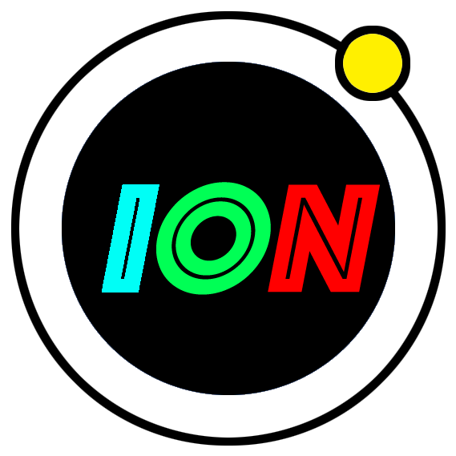
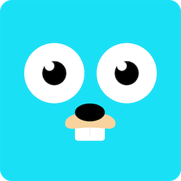

<div align=left><a href="https://github.com/pion/ion/wiki">
    
</a>


#### *ION is a distributed real-time communication system, the goal is to chat anydevice, anytime, anywhere!*

[](https://travis-ci.com/pion/ion)[](https://goreportcard.com/report/github.com/pion/ion)[](https://opencollective.com/pion-ion) [](https://pion.ly/slack)

## Architecture


## Modules


| **Name**                                                     | **Information**                                              |
| ------------------------------------------------------------ | ------------------------------------------------------------ |
| <a href="https://github.com/pion/ion"> </a>[**ION-BIZ**](https://github.com/pion/ion)                   | *Business signal server*                                  |
| <a href="https://github.com/pion/ion"> </a>[**ION-ISLB**](https://github.com/pion/ion)                  | *Intelligent-Server-Load-Balancing server*                 |
| <a href="https://github.com/pion/ion">  </a>[**ION-SFU**](https://github.com/pion/ion)                   | *Selective-Forwarding-Unit server*                         |
| <a href="https://github.com/pion/ion-sdk-js">  </a> [**ION-SDK-JS**](https://github.com/pion/ion-sdk-js)         | *Ion js sdk written by typescript*                         |
| <a href="https://github.com/pion/ion-sdk-flutter">  </a>  [**ION-SDK-FLUTTER**](https://github.com/pion/ion-sdk-flutter) | *Ion flutter sdk powered by [flutter-webrtc](https://github.com/cloudwebrtc/flutter-webrtc)* |
| <a href="https://github.com/pion/ion-app-web">  </a> [**ION-APP-WEB**](https://github.com/pion/ion-app-web)       | *Ion web app*                                              |
| <a href="https://github.com/pion/ion-app-flutter">  </a> [**ION-APP-FLUTTER**](https://github.com/pion/ion-app-flutter) | *Ion flutter app*                                          |

## Documentation

### Deps

This project uses docker

https://docs.docker.com/get-docker/

### Setup
```
docker network create ionnet
```

### Run
```
docker-compose -f docker-compose.stable.yml up
```

For dev and more options see the wiki

* [Development](https://github.com/pion/ion/wiki/DockerDev)


## Roadmap

[Projects](https://github.com/pion/ion/projects/1)

## Maintainers

<a href="https://github.com/adwpc"></a><a href="https://github.com/cloudwebrtc"></a><a href="https://github.com/kangshaojun"></a><a href="https://github.com/tarrencev"></a><a href="https://github.com/jbrady42"></a>

## Contributors

<a href="https://github.com/pion/ion/graphs/contributors"></a>

*Original Author: [adwpc](https://github.com/adwpc) [cloudwebrtc](https://github.com/cloudwebrtc)*

*Community Hero: [Sean-Der](https://github.com/Sean-Der)*


